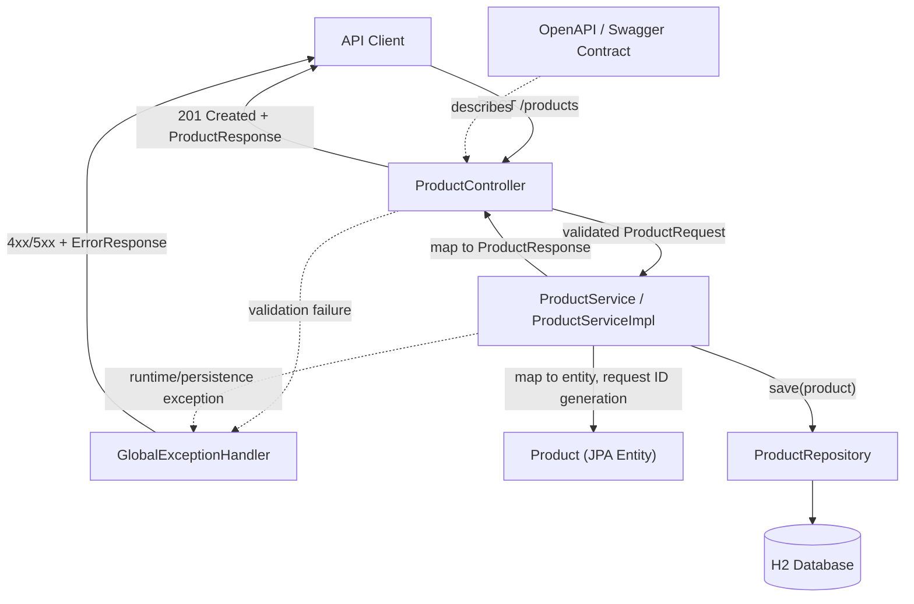

# Architecture: Create Product API (KAN-7)

## 1. Overview

This document defines the technical design for `POST /products`, the first endpoint of the Product Management microservice within the Easy Basket backend (parent Epic KAN-6). The service accepts a product payload (name, category, price, stock), validates mandatory fields and value constraints, generates a unique product identifier, persists the product to an H2 relational database, and returns `201 Created` with the persisted resource. All error conditions — validation failures and unexpected runtime errors — are funneled through a single global exception handler, one instance per microservice, that produces consistent, meaningful `4xx`/`5xx` responses. The repository currently contains no application code, so this design establishes the initial Product Management service structure using the stack already implied by the requirements (Java, Spring Boot, H2), rather than introducing an unrelated stack.

> **Design review update (2026-08-15)**: all open risks/gaps from the initial review were resolved with the user and are recorded as Agreed Design Decisions in `documents/design-review.md`. This document has been updated accordingly; see §7 for a per-item summary.

## 2. Technology Choices

| Choice | Rationale (tied to requirement) |
|---|---|
| **Java 17 (LTS)** | Requirements explicitly reference "Java/Spring Boot coding standards" (NFR1, FR requirements narrative). Java 17 is the current LTS baseline for modern Spring Boot 3.x. |
| **Spring Boot 3.x (Web, Validation, Data JPA)** | Requirements narrative and NFR1 explicitly require "Spring Boot conventions." Spring Web supplies the REST controller model; Spring Validation (Jakarta Bean Validation) implements FR3–FR5 declaratively; Spring Data JPA implements FR7 (persistence) with minimal boilerplate. |
| **H2 Database (file-based, per-service)** | FR7 explicitly mandates persistence "in an H2 database." A per-service H2 instance also keeps the Product Management service independently deployable (NFR4) with no shared database coupling. |
| **Spring Data JPA + Hibernate ID generation (`GenerationType.IDENTITY`)** | FR6 requires a unique product ID per product; confirmed to use numeric auto-increment (`Long id`, `GenerationType.IDENTITY`) — see Assumptions & Risks §7.2. |
| **Jakarta Bean Validation (`@NotBlank`, `@Size(max=255)`, `@NotNull`, `@Positive`, `@PositiveOrZero`, `@Digits`) on request DTOs** | Declarative validation directly satisfies FR3 (mandatory fields) and FR5 (reject negative/invalid price and stock) while keeping validation logic out of controller/service code (NFR1 clean code). `price` uses `@Positive` (0 is not valid) with `@Digits(integer=..., fraction=2)` for currency precision (USD assumed); `stock` uses `@PositiveOrZero` (0 is valid); `name`/`category` are capped at 255 characters via `@Size(max=255)`. |
| **`@RestControllerAdvice` global exception handler** | FR9 and NFR6 explicitly require centralized error handling. Spring's `@RestControllerAdvice` + `@ExceptionHandler` is the idiomatic Spring Boot mechanism. Confirmed as one `@RestControllerAdvice` instance per microservice (this service owns its own copy; not a single component shared across services), consistent with NFR4 independent deployability. |
| **springdoc-openapi (OpenAPI 3 / Swagger UI)** | NFR3/FR10 require the API to conform to an approved API/Swagger contract and for contract changes to be version-controlled and documented. Generating and publishing the OpenAPI spec from annotated controllers/DTOs gives a single source of truth that can be diffed and reviewed. |
| **Maven (single-module, per-microservice repo layout)** | Standard, low-friction build tool for Spring Boot; each business capability (Product Management, future Order Management, etc.) is its own independently buildable/deployable module per NFR4. |
| **JUnit 5 + Mockito + Spring Boot Test (`@WebMvcTest`, `@DataJpaTest`, `@SpringBootTest`)** | NFR2 requires unit and integration tests covering positive, negative, validation, and boundary scenarios. These are the standard Spring Boot testing layers, allowing controller-level, repository-level, and full-stack tests without duplicated setup. |
| **JaCoCo (coverage plugin, enforced ≥80% via Maven build)** | NFR2 mandates a measurable minimum of 80% test coverage; JaCoCo integrates with Maven to fail the build below threshold, making the requirement enforceable rather than aspirational. |
| **SLF4J + Logback (default Spring Boot logging)** | Supports observability of validation failures and exceptions handled by the global handler without adding a new dependency beyond the Spring Boot default. |

## 3. Components

| Component | Responsibility | Key Interfaces |
|---|---|---|
| **`ProductController`** | Exposes `POST /products`; delegates to the service layer; maps successful creation to `201 Created` with the `ProductResponse` body per contract (FR1, FR8, FR10). No `Location` header is set, since `GET /products/{id}` is not in scope for this story (see §7.8). | `POST /products(ProductRequest) -> ResponseEntity<ProductResponse>` |
| **`ProductRequest` (DTO)** | Inbound payload shape; carries Bean Validation annotations for mandatory fields, strictly-positive price, non-negative stock, and length limits (FR3, FR5). | Fields: `name: String (@NotBlank @Size(max=255))`, `category: String (@NotBlank @Size(max=255))`, `price: BigDecimal (@NotNull @Positive @Digits(integer=..., fraction=2))`, `stock: Integer (@NotNull @PositiveOrZero)` |
| **`ProductResponse` (DTO)** | Outbound payload shape returned on success; decouples persistence entity from the public contract (NFR3/FR10). | Fields: `id`, `name`, `category`, `price`, `stock` (+ any contract-mandated metadata once confirmed) |
| **`ProductService` (interface) / `ProductServiceImpl`** | Business logic: orchestrates ID generation, delegates persistence, maps entity ⇄ DTO; keeps controller thin (NFR1). | `createProduct(ProductRequest) -> ProductResponse` |
| **`Product` (JPA entity)** | Persistent representation of a product; owns ID generation strategy and maps to the H2 schema (FR6, FR7). | Fields: `id`, `name`, `category`, `price`, `stock` |
| **`ProductRepository`** | Spring Data JPA repository abstracting H2 persistence (FR7). | `extends JpaRepository<Product, ID>` |
| **`GlobalExceptionHandler` (`@RestControllerAdvice`)** | Single instance, scoped to this microservice, translating validation errors (`MethodArgumentNotValidException`), constraint violations, and unhandled exceptions into consistent `4xx`/`5xx` error responses (FR4, FR9, NFR6). One `@RestControllerAdvice` per microservice, not shared across services. | `@ExceptionHandler(MethodArgumentNotValidException.class)`, `@ExceptionHandler(Exception.class)` → `ErrorResponse` body |
| **`ErrorResponse` (DTO)** | Standard error payload shape (status, message, field errors, timestamp) used by the global handler for every rejected request. | Fields: `status`, `error`, `message`, `fieldErrors[]`, `timestamp` |
| **OpenAPI/Swagger definition** | Machine-readable contract generated from controller/DTO annotations; basis for contract-compliance verification (NFR3, FR10). | `/v3/api-docs`, `/swagger-ui.html` |
| **H2 Database (per-service datastore)** | Durable storage for product records, isolated to the Product Management service (FR7, NFR4). | JDBC connection via Spring Data JPA; no external service accesses it directly |

## 4. Component Diagram

## 5. Positive & Negative Data Flow

### 5.1 Positive flow — successful product creation

1. Client sends `POST /products` with a JSON body containing valid `name`, `category` (both ≤ 255 characters), `price` (strictly > 0, up to 2 decimal places), and `stock` (≥ 0).
2. `ProductController` receives the request; Spring binds it to `ProductRequest` and triggers Jakarta Bean Validation (`@Valid`).
3. Validation passes (all mandatory fields present and within length limits, `price` strictly positive, `stock` non-negative).
4. `ProductController` calls `ProductService.createProduct(request)`.
5. `ProductServiceImpl` maps the DTO to a `Product` entity and calls `ProductRepository.save(product)`.
6. Spring Data JPA/Hibernate generates a unique ID (FR6) and persists the row to H2 (FR7).
7. The saved entity is mapped to a `ProductResponse` and returned to the controller.
8. `ProductController` returns `HTTP 201 Created` with the `ProductResponse` body only. No `Location` header is set, since `GET /products/{id}` does not exist in this story's scope (§7.8), matching the approved API contract (FR8, FR10).

### 5.2 Negative flow — validation failure (missing/invalid field or negative value)

1. Client sends `POST /products` with a missing mandatory field (e.g., `name` blank), an oversized `name`/`category` (> 255 characters), a `price` that is zero, negative, or has more than 2 decimal places, or a negative `stock`.
2. `ProductController` receives the request; Spring's `@Valid` binding fails Bean Validation before the controller method body executes.
3. Spring raises `MethodArgumentNotValidException`, which propagates past the controller (request never reaches `ProductService`).
4. `GlobalExceptionHandler.handleValidation(...)` intercepts the exception, extracts per-field validation errors, and builds an `ErrorResponse` (FR4, FR9, NFR6).
5. The handler returns `HTTP 400 Bad Request` with a body listing the specific field(s) and reason(s) that failed (meaningful error message, no product persisted).

### 5.3 Negative flow — unexpected/persistence error

1. Client sends a structurally valid request, but persistence fails (e.g., H2 connectivity/constraint issue) or an unforeseen runtime exception occurs in `ProductServiceImpl`.
2. The exception propagates up through the controller.
3. `GlobalExceptionHandler.handleGeneric(Exception ex)` catches it, logs the failure (via SLF4J) without leaking internal stack traces to the client, and returns a generic `ErrorResponse`.
4. Client receives `HTTP 500 Internal Server Error` (or a mapped `4xx` if the cause is client-attributable, e.g., a future duplicate-key rule) with a consistent error shape identical to the validation-failure response structure.

## 6. Non-Functional Considerations

- **Test Coverage ≥ 80% (NFR2)**: JaCoCo is bound to the Maven `verify` phase with a coverage rule enforcing ≥80% line/branch coverage for the `product` package; the build fails if unmet. Test layers: `@WebMvcTest` for controller + validation behavior (positive, missing-field, oversized `name`/`category` (> 255 chars), boundary `stock=0` (valid) and `price=0` (invalid — must be rejected) cases, and `price` with more than 2 decimal places), `@DataJpaTest` for repository/persistence behavior, and a `@SpringBootTest` (full context, H2) integration test for the end-to-end `POST /products` happy path and error path. Coverage measurement and enforcement are recorded in `documents/testing-strategy.md` by the test-verification stage of this workflow, not in this document.
- **Contract Compliance (NFR3, FR1, FR10)**: springdoc-openapi generates the live OpenAPI spec directly from `ProductController`/DTO annotations, so the implementation and the published contract cannot drift silently. Any change to request/response shape requires a corresponding, reviewable diff to the generated spec, satisfying the "version-controlled and documented" requirement from Confluence. Contract conformance (field names, types, status codes) is verified in controller-level tests that assert exact JSON shape.
- **Microservice Independence (NFR4)**: The Product Management capability is scoped to its own Maven module/deployable unit with its own embedded H2 instance and no compile-time or runtime dependency on other business capabilities (e.g., Order Management). All product-domain classes live under a single `product` package/module boundary so the service can be extracted to its own repository later without cross-cutting refactors.
- **Scalability (NFR5)**: The service is stateless per request (no in-memory session state) and uses connection-pooled JPA access, so multiple instances can run behind a load balancer for horizontal scaling. H2 is confirmed as the datastore for this story only (see §7.7); no follow-up migration ticket is planned as part of this design.
- **Error Handling (NFR6, FR4, FR9)**: A single `@RestControllerAdvice` (`GlobalExceptionHandler`), one instance per microservice, is the only place within this service that translates exceptions to HTTP responses, ensuring every error — validation, persistence, or unexpected — returns the same `ErrorResponse` shape and appropriate status code, rather than ad hoc try/catch blocks scattered across controllers. This is a per-microservice pattern, not a component shared across services (see §7.9).
- **Security**: No authentication/authorization is implemented for this story per confirmed decision (§7.1). This is a deliberate, agreed scope exclusion, not a silent omission.

## 7. Assumptions & Risks

*The following items were reviewed during design review and confirmed with the user on 2026-08-15 (see `documents/design-review.md` §3, Agreed Design Decisions). Each is now a confirmed decision for this story, not an open assumption.*

1. **No authentication/authorization required for this story (confirmed).** `POST /products` is implemented as an open endpoint. This is a deliberate scope exclusion for KAN-7; no follow-up security ticket was requested.
2. **Product ID generation strategy confirmed as `GenerationType.IDENTITY` (numeric auto-increment `Long id`).**
3. **`stock = 0` is valid; only negative values are rejected.** Validation uses `@PositiveOrZero` for `stock`.
4. **`price` must be strictly positive; `price = 0` is not valid (confirmed).** Validation uses `@Positive` (not `@PositiveOrZero`) for `price`, in addition to `@Digits(integer=..., fraction=2)` for 2-decimal-place USD currency precision (§7.10). This corrects the design's earlier `@PositiveOrZero` assumption for `price`.
5. **No product-name uniqueness constraint (confirmed).** No unique index/constraint is planned on `Product.name` for this story; duplicate product names are accepted.
6. **Product schema confirmed as `name`, `category`, `price`, `stock`, plus a generated `id` — no additional fields.** No SKU, description, image URL, or category-as-entity are in scope for this story.
7. **H2 confirmed as the datastore for this story (no follow-up ticket).** A horizontally scaled deployment (NFR5) sharing a single H2 file/instance across replicas is not a typical production pattern, but migrating to a shared, durable datastore is explicitly out of scope and not tracked as a follow-up per the agreed decision.
8. **No `Location` header on `201 Created` responses (confirmed).** The header is omitted because `GET /products/{id}` does not exist; only `POST /products` is in scope for this story.
9. **`GlobalExceptionHandler` is one instance per microservice (confirmed).** This service includes exactly one `@RestControllerAdvice`; it is not a single component shared across services, consistent with NFR4 independent deployability.
10. **`price` precision confirmed at 2 decimal places (`@Digits(integer=..., fraction=2)`), USD currency assumed.**
11. **`name` and `category` confirmed at max length 255 characters (`@Size(max=255)`).**
12. **Confluence page truncation — no further re-fetch needed (confirmed).** `documents/requirements.md`'s functional/non-functional/acceptance criteria are treated as sufficient as-is for this story.
